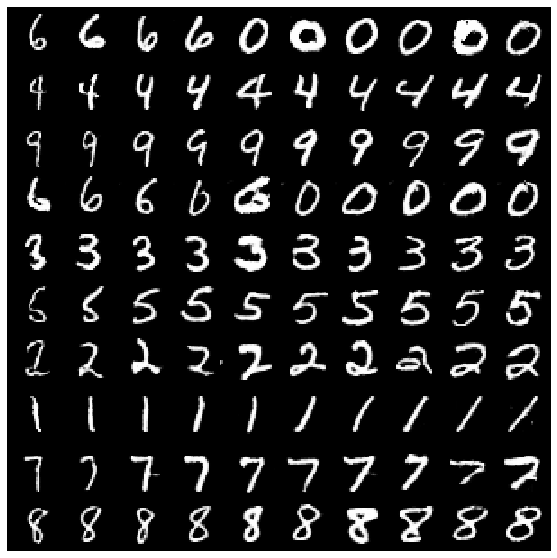

# Information-Maximizing-GAN

## Training the Networks
```
python train.py
```
```
Epochs:1	G Loss: 0.6270	D Loss: 1.4954
Epochs:2	G Loss: 0.2449	D Loss: 2.1458
.
.
Epochs:100	G Loss: 0.2088	D Loss: 4.2551
```


## Generated Images
```
python generate.py
```

### Varying Angle 


### Varying Thickness

